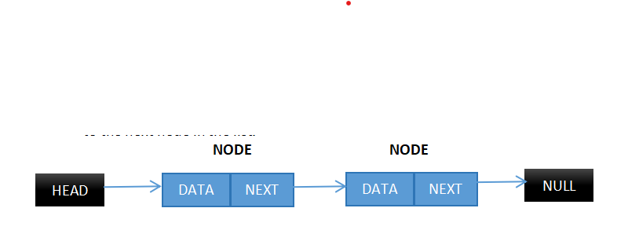

# Linked Lists

- Linear data structure
- Elements are not stored in contiguous memory locations (they are not stored in adjacent locations in memory)
- Elements in a linked list are linked using pointers
- In short, a linked list consists of nodes where each node contains a data field and reference link to the next node in the list.

## Types of Linked Lists

### 1. Singly linked list

- The simplest linked list. Each data is just linked to the next node in line like shown above.

### 2. Doubly linked list

- In this linked list, a node contains a reference to both the next and previous node.

#### Advantages over singly linked list

- Can be traversed in both forward and backward directions
- Deletion operation is more efficient
- We can quickly insert a new node before a given node
- Backtracking in algorithms is more efficient

#### Disadvantages

- Require more memory to store the extra pointers
- It is a more complex implementation
- Require extra operations to maintain the integrity of the list
- Slower traversal than arrays for random access
- No random access to elements

#### Use cases

- To implement other data structures like hash tables, stacks, binary trees, etc
- Implement functionalities such as undo/redo
- Used in any software which requires forward and backward navigation EG: music players, browsers

### 3. Circular linked list

- There is no null end, the first and last node are connected.
- Can be of two types, circular singly linked list (nodes only point to the next but the last node points to the first node) and circular doubly linked list (nodes point to both the previous and next node, with the last node pointing to the first node as its next node).

### 4. Header linked list

- A linked list that uses a special head node that is used as a reference to the first node
- Can be used to represent an empty list

## Advantages of Linked lists over Arrays

1. Dynamic data structure: can shrink and grow at runtime by allocating and deallocating memory at runtime so there is no need for an initial size in a linked list.
2. No memory wastage: Only the required memory is allocated.
3. Implementation: other structures like queues and stacks can easily be implemented using Linked lists.
4. Insertion and deletion: No need to shift every element after insertion, only the address in the related pointer needs to be updated

## Disadvantages of Linked Lists over Arrays

1. Memory usage: memory required by a linked list is more than the memory required by an array, as there is also a pointer field with the data field.
2. Random access: to access a node at index x in a linked list, we traverse all the nodes before it, but in arrays, we can directly access elements at a specific index
3. Reverse traversal: In a singly linked list, reverse traversal is not possible as only the address of the next node is stored. In doubly linked lists, reverse traversal is possible but it consumes more memory as we have to allocate extra memory to store the previous pointer, while in arrays, that is easily accomplished by loops.
